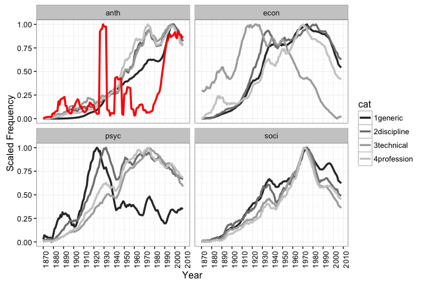

# Chapter 0 - Aparadigmatic Development of Scholarly Disciplines
Brooks Ambrose  
October 21, 2015  

##Abstract

##Table. Concepts in this section.

+-----------+-------------------+---------------------+----------------------+
| __Child__ | __Social Parent__ | __Cultural Parent__ | __Cognitive Parent__ |
+===========+===================+=====================+======================+
| Label     | Power             | Genre               | Schema               |
|           |                   |                     |                      |
| Address   | Influence         | Reference           | Idea                 |
+-----------+-------------------+---------------------+----------------------+

#Paradigms: A High Bar for Scholarly Disciplines

Stage-sequential Development of Scholarly Disciplines

Between 1900 and 1925 each American social science discipline distinguished itself as an autonomous profession.

A key component of the establishment of each as a field was the development of a pan-disciplinary convention of citing references.We take for granted the use of citations as a currency of information flow and authorial recognition, but early in the century it was not a norm to provide precisely codified descriptions of publications. Citations were often very casual, referencing an author by title and surname only, and referring to an idea and not any work in particular. These proto-citations required a contemporary grasp of context to be intelligible, as do citations today, but they lacked the address-like codification that would allow the unknowing reader to actually locate the source in question. 

Signpost b/w E&T

These battles were hard fought, harder still because each was a contest on cultural, cognitive, and social fronts. While all human behavior can be analyzed as consisting in different ratios of all three components, the institutional development of professions procedes in a conditional order. While a ^[In sociology to declare something an institution is to ask how patterns of human behavior became regular and to excavate the hidden mechanisms that maintain that regularity within limits. Religious practice is regulated by the church, political practice by the state [@Sewell:2005vq\:172]. Such large scale organizations eclipse the cultures that provide the content around which they initially organized. They assure their own cultural inputs, and may be open or closed with respect to novel culture.] A proto-institution begins to cohere  Culture preceeds cognition in the sense that practices develop tacitly before they are "recognized" explicitly, and indeed recognition is, while often transformative, not actually necessary. On the contrary a cultural thing, whether an object or a practice, must already exist for it to be recognized. Likewise cognition, especially classification, preceeds social control Cultural processes center on human interaction with meaningfully constituted objects. This far reaching concept is usefully characterized in the tradition of Geertz where culture exists at the intersection of symbolically organized thought and concrete practice. Since Geertz priority has been placed This polarity between real and ideal may be adapted in a tr

A discipline must cohere culturally before it can professionalize, and this process occurs in four stages. First, a prototypical set of productions--articles, books and lectures--had either to be found or invented, and the patterns they established had to be reproduced without the benefits of consistent resources or conventions. Second, assembeled productions had to become recognizable; they had to be labeled and grouped together according to a consistent symbolism, and that symbolism had to be learned within a broader milieu. Third, after a symbolic index could be taken for granted, disciplines would be stillborn if they could not maintain productivity. Would-be disciples had to produce enough new material to support an audience intially of peers and then of larger publics. Fourth, to emerge as professions, disciples had to have a reasonable chance of being awarded scarce resources within the academy. The ability to attach the disciplinary label to departments and professorships marked the beginning of a viable adolescence. If a discipline could aqcuire the machinery of education it could control the presumption of its own legitimacy, at least among new generations of students.

###Table. Stages and their sociocultural mechanisms.
+---------------------+-----------------+--------------+
|      __Stage__      | __Sensemaking__ | __Control__  |
+=====================+=================+==============+
| __1. Prototyping__  | Obsession       | Private      |
|                     |                 |              |
| __2. Assemblage__   | Recognition     | Peer         |
|                     |                 |              |
| __3. Facilitation__ | Mastery         | Provider     |
|                     |                 |              |
| __4. Accumulation__ | Competition     | Professional |
+---------------------+-----------------+--------------+

This study is about the second stage of development, recognition. I assume that protoypes of disciplinary knowledge were readily available in the United States by the end of the 19th century, and that the challenge for disciples was to relabel what had already been accomplished in an effort to create an occupation out of what was formally a personal undertaking, an obsession or a pastime.

#Cultural Sensemaking

In order to regulate their own creative activity, disciples curated prototypes into sets that drew a boundary, however roughly, around the tacit definition of what they thought they were doing. These acts of sorting allowed prototypes to be organized without requiring the organizer to explain the rules of their order. 

Wherever personal sets overlapped the intersection would form a smaller set of higher status. This tendency to overlap one's personal cultural toolkit with that of others was a form of deference to peers as well as to common culture. This allowed disciples, without intention, both to claim membership in the discipline and to indulge in their idiosyncratic variations on the essence of the discipline. Indeed idiosyncracy would be tolerable only to the extent that a scholar could in the same breath genuflect to what was already understood.

While new references to the overlapping set reinforced its status they also winnowed its content. Paradoxically by begging to peers that they recognize some novel prototype scholars would have to also pay homage to the core. They could not then elevate their own interests above that of the growing stock of taken for granted knowledge, since introducing something could not garner attention without attaching it to something old.

 

The rejoinder to the claim that nothing can overtake the core is found in Kuhnian accounts of scientific revolution. Yet the theory of referential coherence could not be further from that of paridigmatic coherence. The great advantage of using references as the currency of disciplinary communication and exchange is that their meanings can be assumed, and the inevitable disagreements over interpretation can be easily ignored so long as conversation floats just above matters of substance. Paridigmatic agreement is not culturally, that is autonomously, possible unless one makes a very strong empirical convergence assumption. Exogenous reality must weigh so heavily on the mind that the concept of interpretation can be dismissed. If however interpretive variation is the norm then we can also posit that within limits the same larder satisfies chefs so long as each is free to cook according to her particular tastes.

Such tastes are not merely metaphorical; an important feature of this conceptualization is that scholars produce work for their own consumption first, especially early in the development of a discipline. There must be a point of origin where cultural sensemaking is idiosyncratic to the creator. It is only with time that multiple idiosyncracies can be commensurated, and given such commensuration there can be no expectation that consensus develops to the point of uniformity in thought even in a solitary thinker not to mention a community of scholars.

If cultural sensemaking were the only mechanism of disciplinary coherence then it would draw people together but only weakly. Though the kernel of a core set of references may grow this does not imply a tendency for disciplines to become closed culturally. What truly bonds scholars is the opportunity to stand up and be seen through ceremonies around the core while being otherwise totally invisible when pursuing idiosyncratic interests.

##Relevance

#Cognition

Here I attempt to combine internalist and externalist theories of culture. "Art for art's sake" characterizes the internalist view; cultural expression is both motivated and regulated by a concept of the object and standards of quality that, no matter how they got there, are autonomously held in the mind of the creator. "Art for the artists's sake" characterizes the externalist view, where the interests of the creator may be multiply determined by a number of social pressures including fame, fortune, fraud, or force. Many couplets of opposing forces--knowledge and professions, culture and society, truth and power--merely replicate this basic distinction.

Yet the internal/external distinction is generic and restrictive. The underlying references concern how a person might orient herself to cultural production, and how such productive activity may be embedded in larger social structures and cultural milieus. I break this distinction into three simple processes that make creative work easier.

#Social Structures

It is during the period where recognition develops that social control begins to collide with personal sensemaking. This control may at first go no further than a group of peers beginning to enforce conventions of practice or symbolism by asking or demanding that a concept be manifest in this way and not that way, or that it not be expressed at all. If the chief mode of personal sensemaking is sorting objects into sets of similarity or difference, the  nascent form of social intrusion on cultural sensemaking is attaching labels to the sets of others. If a sensemaker is exposed to sets with the same label and different contents then any attending pressure of contradiction would be most easily resolved by direct interference with someone else's process of personal sensemaking. Disengaging from the contradiction is certainly an option, but it is likely that the dopplegangers would find themselvs at odds again if they inhabit the same milieu.

If there is a weak social force drawing thinkers together at the overlap of their sensemaking, it will pale in comparison to exogenous sources of social control that can define cultural relevance by fiat, force, fame, or facilitation.
Even politically motivated ideologies require constant social control to combat the drift in personal sensemaking.

If a person seeks out social control over their own sensemaking then they are thoroughly socialized. This tautology may describe some people most of the time and everyone some of the time. Even if I stipulate that a sensemaker is delighted when someone else expresses a thought that makes sense to her, such delight must be predecated on the prior development of recognition, or else identical thoughts would pass each other unrecognized like ships in the night.

A cartographic metaphor will be useful. The indexing of the set occurs when a set is labeled, and this is analogous to the name of a contiguous territory on a map. The territory is defined only by the boundary that encloses it, and no knowledge of its contents is necessary to refer to the label. Any content discovered must be categorized de novo, and the boundaries provide the decision rule to accomplish this. Recognition of bounded content occurs when the content is given an address. The address need only lead a searcher to a point of contact with the content, for the address is only a reference and bears no knowledge of its own.

It is entirely possible that discourse around a set of references can be sustained without ever referring to underlying content. The great efficacy of organizing cultural objects into sets of addresses is that it is much easier to agree on the address than it is to agree on the character of what is addressed.

In Parsons's terms the addresses are a form of influence. Influence is a currency bearing social status that allows communication to occur generically and at a pace faster than would be the case if the real underlying content had to be mobilized. Money is the archtypical form of generalized media, allowing exchanges can be defined prior to the actual mobilization of goods and services.

By organizing cultural history into categories, disciples solved two important problems. First, they sanctioned ignorance; lack of knowledge beyond the curated set would be no threat to disciplinary credentials. Second, they created a method of communicating tacit knowledge where formal codification or training was absent. If a scholar were able to reference the contents of a curated set in ongoing conversations he would be rewarded with membership in a self-organized community of scholars including anyone willing to uphold the legitimacy of the discipline. While variations in the quantity and quality of set references confer differences in status iternally, a reference no matter how controversial signaled deference to the discipline and would be treated as a credential for membership.

Such curation served as a critical factor to scholarly production in both of its forms, research and education. The cultural artifacts of curation left by research were the footnotes and bibliographies of books and articles, that left by education were lectures and course syllabi.

Professional activity routinizing the reproduction of the pattern these protypes established. They developed legitimacy for the low level of extant cultural production, low relative to the subsequent historical growth of disciplines.

Recognition, a process that amounts to the social organization of existing cultural material. This is the process of genre formation. Though the term is sometimes use to refer to the entire developing art world or field of cultural production [@Lena:2008er], *genre* is better reserved to refer to the development of the cognitive institution alone. Here genres represent the collision of social constraints with cultural production. ^[In Habermas's terms, genres represent a development of system against lifeworld. In Bourdieu's terms, genres are fields, specifically the definition of positions to be taken.] The initial symbols were indexical, allowing productions to be labeled according to a cogntive categories representing the disciplines. For the U.S. social sciences, by the end of the ninteenth century symbolism had already been developed around the . In this regard scholarly disciplines behave according to a logic of development that has been articulated in the context of artistic genre.

Tendencies leading to each of these thresholds followed different yet often intersecting developmental logics.

##Typology of Relationships

#Knowledge & Professions

##Label: The Disciplinary Prefixes

## Summary: Cultural and Social Mechanisms

A cultural action is teleological, autonomously controlled, socially neutralized, facility constrained, and indeterminant. A social action is
teleological, heteronomously controlled, culturally neutralized, constrained normatively by prestige, sanctions, and rightness or competitively by scarcity, acquisition, and attrition, and determinant. A sociocultural behavior is merely an admixture of the two.

###Teleology

Not all of the things people "do" are behaviors in this sense. Teleological behaviors have a goal or end known to the subject

Whether knowledge is found or invented is less important than whether it is addressable; knowledge that is not recoverable might as well not exist. Addressing occurs when a source is recoverable via a portable reference to its location. Because using knowledge tends to reinforce rather than deplete it, knowledge is only paradoxically scarce. Knowledge is scarce to the extent that it is easily lost.

Such references went through a process of formalization wherein casual statements of credit were replaced with precise street address-like registrations of locations. When for whatever reason citations became precisely codified, especially in the journal space, it became possible to use references as a form of currency in the profession. Here the function of citations became something more than an aide to understanding the text; they became on one hand raw material for sustained cultural production and on the other a set of credentials for membership in social science disciplines and their specialties.

Citations now play several roles, some of which are largely decoupled from the underlying cultural content to which the citation ostensibly points. The role of citations at the center of this article concerns how they are used by researchers to jockey for legitimacy in a competitive professional field. Citations in this sense are neither forms of cultural capital, for they may be used without understanding their significance, nor forms of social capital, because they rarely connote personal ties among the authors. Instead I consider the claim that citations are adoptable traits which refer to the abstract social categories of inclusion and exclusion that form one of the institutional bases of the academic profession. Insofar as particular lists of references must be cited to request or signal membership in an extant professional club, citations become a currency of status exchange.

If a list of citations acts as a credential, there is variability in the length and content of the list, and this variability may become the basis of esoteric hierarchies within disciplines.

Rewards are stratified into two tiers, the first of which is socially dominant and the second culturally dominant. In the first tier the reward is membership in the professorial occupation. Given the first, the second reward is prority ranking. This is the formal recognition that accrues to legendary individuals. A horizontal stratification attends the segmentation of disciplines--subdivisions allowing more space for local heroes. ^[Except for rare celebrities that a discipline would honor beyond its own boundaries, but again this is a cultural gesture whose tangible rewards are irrelevant to the recipient.] [@Gustin:1973ul]

It is only within these subdivisions--including the power elite as a small and local community of its own--that Bourdieu's fields of cultural production operate according to a logic of peer recognition. Yet these local communities do not form the larger share of a professor's quotidian reward. As a sanctioned officer of the academy professors enjoy influence not with their peers but with their laity--students and members of the disciplinary public. Horizontal stratification also allows professors to safely exchange recognition across disciplinary boundaries without fear of competition.

#Empirical Foundations

This brief foray into the different sociocultural functions of citations may be demonstrated by the observation of the formative moments of U.S. social science. The impressions left by the earliest social scientists became a terrain of disciplines and  that could be landscaped but not easily turned over by future generations. Paradigms or hegemonic cultures developed in the first half of the 20th century. These paradigms endured even during times of social upheaval such as the Great Depression and WWII. However, at the dawn of the 1960s, such monoliths were toppled in quick succession. For the first time in American history, the cultural heritage was treated in an a la carte fashion by new generations. What was really different about the 1960s?

##A lexical sample

Each study depends on a database of records of the contents of journals. This database is compiled from two sources, JSTOR and the Thompson Reuters Web of Knowledge Social Science Citation Index (WOK).

Ideally, I would analyze the entire stock of recorded publication material to give the best chance of observing when authors contravene institutional boundaries. Practically, I must take a sample, however sampled networks are not small versions of the population network [@Handcock:2010iw]. Sampling may have the effect of degrading the network cohesion on which community detection methods depend, such that a method will not detect the same boundaries in a sample as it would in the population. To avoid a sampling effect on network cohesion, I draw a full census of articles, reviews, and book reviews from each journal selected.

Sampling on journals creates another problem, which is to merely reproduce boundaries coextensive with the journals from which the articles are drawn. Even though journals market themselves at catering to particular disciplines and subfields, I should not assume that authors, editors, and reviewers always obey these distinctions. If a scholarly field exists with a grounding in two or more journals, the omission of one may also degrade its cohesion to the point of rendering its boundaries undetectable. As an indicator of affiliation among journals, I use Leydesdorff's [-@Leydesdorff:2010ci]

I should also expect to observe boundaries due to several other institutional levels higher than journals, like publishers, disciplines, or national and language groups. To provide ample opportunity to observe boundaries existing in the space between journals and between academic disciplines, I also take a large sample of journals

To observe some of these high level institutions, I draw sets of journals from four social science disciplines–anthropology, sociology, economics, and political science–and I draw these in blocks from the same publisher. Journals were selected from the disciplinary affiliations signaled in their titles. From a JSTOR master list of archived materials, journals were selected if they contained any of the disciplinary prefixes anth-, soci-, econ-, and poli-. {{Though not all journals that are affiliated with a discipline signal this with a word containing the signature prefix, those that do are affiliated with a high degree of accuracy. Soci is an exception, and journals like the Royal Society of Statistics [madeup] are excluded.}} This list was cross referenced with the TR WOK database.

To begin it will be useful to consider a theory that is diametrically opposed to the classification of groups. I find one in Bourdieu's essay, *The Social Space and the Genesis of Groups* {*Bourdieu:1985wh}. Bourdieu claims that marxian social class categories, and their implied boundaries, are analytical constructs with no real referent in the world. The rules for placing an uncategorized actor into a class are well established in any number of class theory traditions. The rules relate to attributes of the actor which may be independently measured, e.g. does she sell labor or buy it? If she sells it, she is a proletarian, if she buys it she is a bourgeoise. Because these categorical rules are the analyst's, Bourdieu decries the reification of the boundary between classes so constituted. Rather than a multidimensional multinomial space, Bourdieu argues that people actually exist in the world in a multidimensional euclidean space, where, in capitalism at least, each dimension is a form of capital. Money, for instance, may be used to place people on a scale and the difference in their holding defines their distance along one dimension of that space. cultural capital (the same thing would be true, mutatis mutandis, of the economic game) determines the aggregate chances of profit in all the games in which cultural capital is effective, thereby helping to determine position in social space" [-@Bourdieu:1985wh\:724] Murkier is Bourdieu's notion of relationship. In the field theory relationships tend to be competitive bids for profit in a field constituted by a form of capital. [@Shwed:2012wt]

#A Realist Epistemology

This theory is not empirically identified.

Cultural products will be observed

Sensemaking will not be observed

Social control will not be observed

Sets will be observed

Sets are complex outcomes of publication process, involving inputs from each mechanism.

Mechanism will not be disentangled

Goal is to observe traces of the weakest external boundary. Field. Art World.

Rise and fall of cultural objects as operationalized, not theorized.

Unclear what the operational units mean theoretically, cannot be known without direct observation of missing variables.

The source data are  observations on  documents spanning  years.

#References
